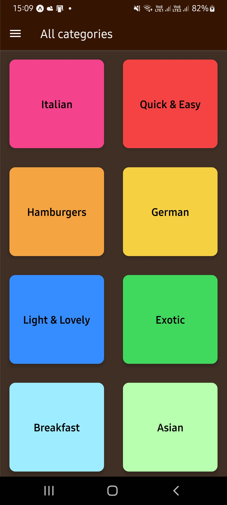
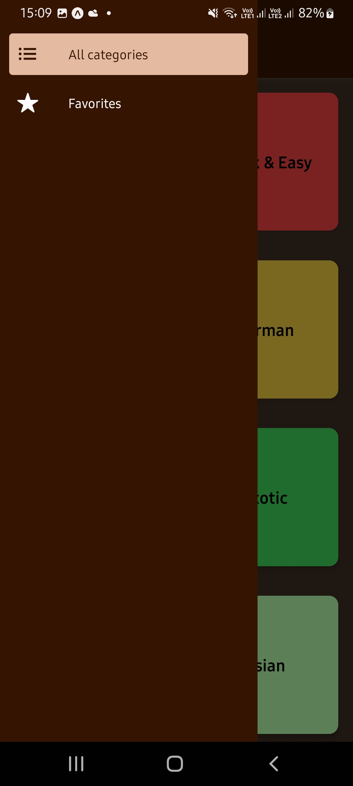
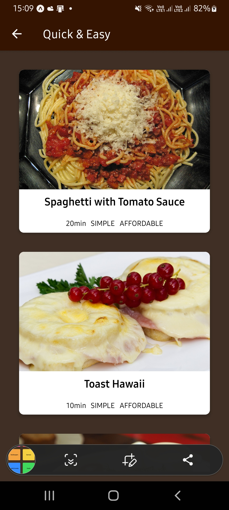
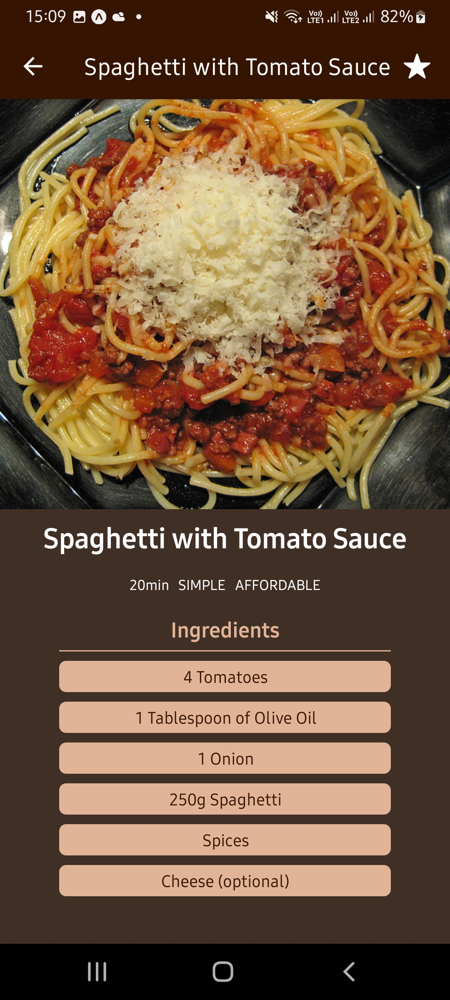
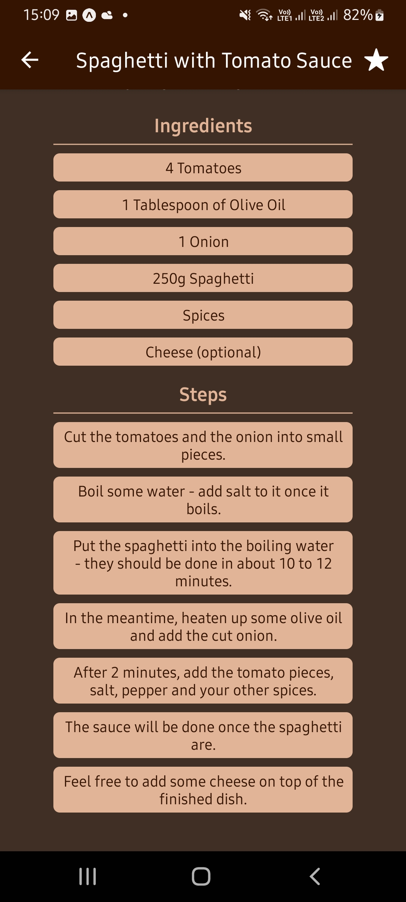

# Meals App

Hello there.
This is a simple App developed in react native.
This app was developed according to the classes of:

React Native - The Practical Guide [2022];

### Setup

Clone it in your machine:
```bash
git clone https://github.com/RodrigoNP3/Meals_App_rn.git
```

### Navigation


<table>
<thead>
<tr>
<th align="center">Main Screen</th>
<th align="center">Drawer Screen</th>
<th align="center">Category Meals Screen</th>
<th align="center">Meal Details Screen</th>

</tr>
</thead>
<tbody>
<tr>
  
<td align="center">
  <a target="_blank" rel="" href="images/main_screen.jpg">
        

  </a></td>
  
<td align="center">
  <a target="_blank" rel="" href="images/drawer_screen.jpg">
        

  </a></td>
  
 <td align="center">
  <a target="_blank" rel="" href="images/category_meals_screen.jpg">
        

  </a></td>

   <td align="center">
  <a target="_blank" rel="" href="images/meal_deatails_screen.jpg">
        

  </a></td>

  

<table>
<thead>
<tr>
<th align="center">Meal Details Screen</th>


</tr>
</thead>
<tbody>
<tr>
  
<td align="center">
  <a target="_blank" rel="" href="images/meal_deatails_screen_1.jpg">
        

  </a></td>

  
